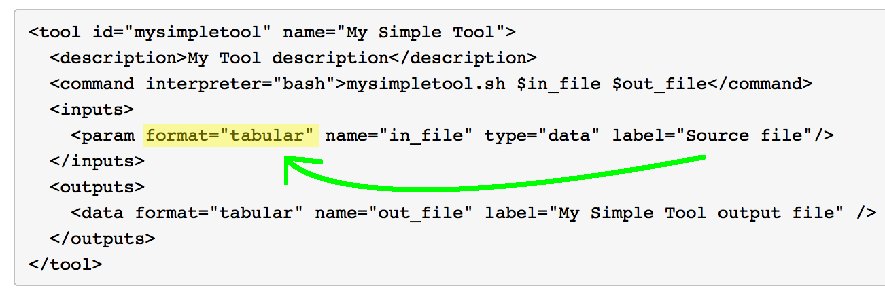

#The Hitchiker's Guide to Galaxy Tool Development

I'm currently learning [Galaxy](http://www.galaxyproject.org/) and I have a first project where I actually need to create 2 Galaxy Tools that will have to be part of a Galaxy Workflow.  So I thought while learning about Galaxy Tool development myself, I would share that learning experience with anyone else that is also starting with Galaxy Tool Development.

First, if you are to develop a Galaxy Tool, you should at least understand the basics of Galaxy. You can find very good tutorials in the [Learn](https://wiki.galaxyproject.org/Learn) section of the [Galaxy Wiki](https://wiki.galaxyproject.org/), there you will find the [Galaxy 101 tutorial](https://wiki.galaxyproject.org/Learn#Galaxy_101) that is a very good starting point.

Another awesome resource to learn about Galaxy is the online [MOOC](https://en.wikipedia.org/wiki/Massive_open_online_course) from **[Johns Hopkins University called Genomic Data Science with Galaxy](https://www.coursera.org/course/gengalaxy)**, hosted on [Coursera](https://www.coursera.org).  This is the one resource I personally used and I loved it.

Note: if you are starting with Bioinformatics and Genomics, you probably want to learn the basics of it if you are a tad serious about it.  You can check that [list of free courses on Coursera about Data Science, Bioinformatics and Genomics](MOOC list to learn Data Science, Bioinformatics and Genomics.md).

##My environment setup
I will not go in the setup details but my development environment is using Oracle Virtualbox using the following [Vagrant box](https://github.com/AAFC-MBB/vagrant-galaxy) on my MacBook Pro.

##Disclaimers
By using any of the information on this website you agree with this **[Disclaimer](http://ourdisclaimer.com/?i=The%20Hitchhiker's%20Guide%20to%20Galaxy%20Tool%20Development)**.

##Tutorial 1 - The simplest Galaxy Tool
My personal approach when comes to developing a pipeline of tools or any tool that interfaces with others is to first fully understand the junction points where those tools connect with each other, a.k.a. where they interface.  The first thing to understand about a Galaxy Tool is that it's in fact a wrapper against another tool through the command line.

Let's jump right in, we'll create a Galaxy Tool called My Simple Tool that will simply create a wrapper against the well known Linux [cat](http://man.he.net/?topic=cat&section=all) shell command, so basically we'll take an input file and throw it back out as is, this will allow us to understand how Galaxy serves an input to your wrapper and then how it takes the output you create to then serve it to the next Tool in the workflow you are building.

Assuming your Galaxy installation is in `/galaxy`:

Create a folder for your tool:

```
    mkdir /galaxy/tools/mysimpletool
    cd /galaxy/tools/mysimpletool
```

First create `/galaxy/tools/mysimpletool/mysimpletool.sh` with the following content:
`cat < $1 > $2`  
This is to wrap the call to `cat` as it is not an executable but a Linux shell command.

Create `/galaxy/tools/mysimpletool/mysimpletool.xml` with the following content:

```xml
<tool id="mysimpletool" name="My Simple Tool" version="1.0">
  <description>My Tool description</description>
  <command interpreter="bash">mysimpletool.sh $in_file $out_file</command>
  <inputs>
    <param format="tabular" name="in_file" type="data" label="Source file"/>
  </inputs>
  <outputs>
    <data format="tabular" name="out_file" label="My Simple Tool output file" />
  </outputs>
</tool>
```

Edit Galaxy Tool list so it is aware of your new tool:
Add **My Section** in `/galaxy/tool_conf.xml`

```xml
<?xml version='1.0' encoding='utf-8'?>
<toolbox>
  <!-- Insert your new section below here-->
  <section name="My Section" id="mysection">
    <tool file="mysimpletool/mysimpletool.xml" />
  </section>
  <!-- End of your new section-->
  <section id="getext" name="Get Data">
    <tool file="data_source/upload.xml" />
    <tool file="data_source/ucsc_tablebrowser.xml" />
    <tool file="data_source/ucsc_tablebrowser_test.xml" />
    <tool file="data_source/ucsc_tablebrowser_archaea.xml" />
```

Now restart Galaxy server, click Analyse Data at the top, you should now see your own section called My Section at left, click it to expand it.


To test our tool we'll need any data in tabular format and  the reason for this is that we specified that the input file that Galaxy will provide to our tool needs to be in tabular format:



Here how to retrieve a quick set of tabular data (BEM format):
Under Tools (left pane), click on `Get Data`, then 

* Click on `UCSC Main table browser`
* Keep the default options and click the GET DATA button
* On the 2nd window, under `Create one BED record per:` 
 * Select `Coding Exons` (simply to limit the amount of data)
* Click on `Send query to Galaxy`

Following this you should have your dataset appear in the History (right pane) with a name along `1 UCSC Main on Human: knownGene (chr21:33031597-33041570)`

Now that you have your tabular data, click on My Simple Tool (that you just created) under the Tool section in the left pane and you should have something like:


Click `Execute` and few seconds later you should see a new Dataset in Galaxy History pane (right) which will be identical to the source dataset you used (as we also had it pass throught `cat`).

If you wonder how Galaxy pass the information to our Tool and then retrieve it, it is actually creating temporary files that it manages: if you were to look at the log while Galaxy launches our tool, you would see the name of those files:

```
galaxy.jobs.runners.local DEBUG 2015-08-09 21:38:36,222 (26) executing: GALAXY_SLOTS="1"; export GALAXY_SLOTS; bash /galaxy/tools/mysimpletool/mysimpletool.sh /galaxy/database/files/000/dataset_25.dat /galaxy/database/files/000/dataset_26.dat
galaxy.jobs DEBUG 2015-08-09 21:38:36,261 (26) Persisting job destination (destination id: local:///)
galaxy.jobs.runners.local DEBUG 2015-08-09 21:38:36,331 execution finished: GALAXY_SLOTS="1"; export GALAXY_SLOTS; bash /galaxy/tools/mysimpletool/mysimpletool.sh /galaxy/database/files/000/dataset_25.dat /galaxy/database/files/000/dataset_26.dat
galaxy.jobs.runners DEBUG 2015-08-09 21:38:36,408 executing external set_meta script for job 26: /galaxy/set_metadata.sh ./database/files /galaxy/database/job_working_directory/000/26 . /galaxy/universe_ws
```

In that log snippet above, you can see the following:

`bash /galaxy/tools/mysimpletool/mysimpletool.sh /galaxy/database/files/000/dataset_25.dat /galaxy/database/files/000/dataset_26.dat`

that's the actual call to our tool (mysimpletool.sh) and if you remember the one command line in there:

`cat <$1 >$2`

$1 is the first parameter, which is the input file `/galaxy/database/files/000/dataset_25.dat`   
and $2 is the second parameter, which is the output file `/galaxy/database/files/000/dataset_26.dat`

That concludes the first tutorial, you should know have a grasp of what is a Galaxy Developer Tool and how to build a basic one!
